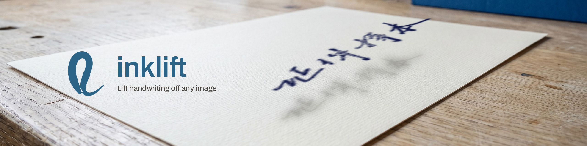
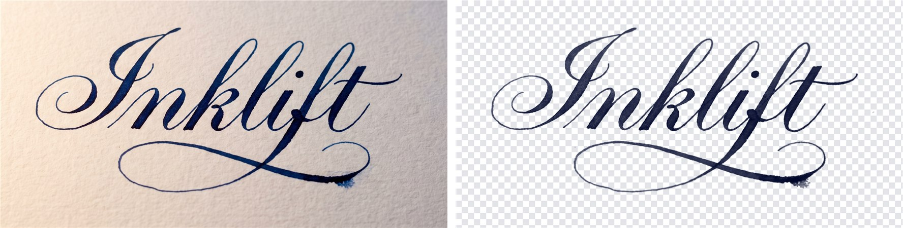
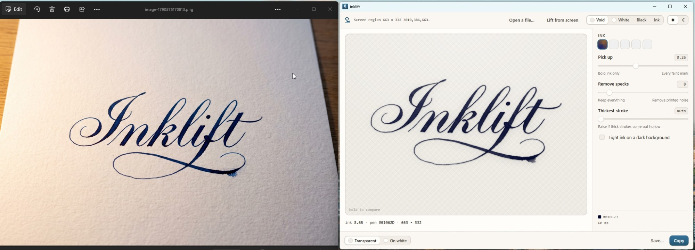

<p align="center">
  
</p>

# inklift

**Extract handwriting from a photo or screenshot onto a transparent background — offline, in Rust, with a real alpha channel instead of a 1-bit mask.**

[](LICENSE)
[](https://www.rust-lang.org)
[](crates/inklift-core/Cargo.toml)
[](#offline-by-default-and-verifiably-so)

Point inklift at anything with writing in it — a phone photo of a notebook page,
a scan, a region of your screen — and it hands back just the ink. The paper is
gone, the strokes keep their own colour and their soft edges, and the result is
a transparent PNG you can drop onto a slide, a dark-themed note, a coloured
page or a photograph and have it look like it was written there.

<p align="center">
  
</p>
<p align="center"><sub>A photo of calligraphy, and what <code>inklift photo.png --window 30</code>
lifted off it. The lettering is an AI-generated sample made for this demo.</sub></p>

It runs entirely on your machine. A stock build links no HTTP client at all.

```console
$ inklift photo.jpg --both
[local] ink 2.9% of page, pen rgb(14, 22, 90)
wrote photo.ink.png
wrote photo.white.png
```

---

## Why this exists

Document binarization is a well-studied problem, and the published methods are
good at it. But almost all of them answer a **yes/no** question — is this pixel
ink or paper? — and emit a 1-bit mask. If you then use that mask as an alpha
channel, which is the obvious thing to want, you get stair-stepped strokes that
composite badly onto anything that is not the background you cut them from.

inklift keeps the two decisions apart:

- The **binary decision** chooses *which* pixels may carry ink.
- A separate **opacity estimate** decides *how much* — derived from the
  illumination-normalized image as `alpha = 1 − normalized`, which follows
  directly from the compositing equation once the ink is darker than the paper.

That is the whole trick, and it is what keeps stroke edges smooth. It lives in
[`crates/inklift-core/src/alpha.rs`](crates/inklift-core/src/alpha.rs).

The second thing that falls out of it: because opacity and pen colour are
stored separately rather than baked into pixels, **recolouring the ink is a
swap, not a re-extraction**. Nothing is recomputed and no quality is lost.

## Features

- **Transparent or white-background output.** Straight (non-premultiplied)
  RGBA, or greyscale ink on white — never a hard binary.
- **Soft alpha, not a 1-bit mask.** Antialiased stroke edges that composite
  cleanly onto any background.
- **Real pen colour, recoverable.** The extractor reports the actual ink colour
  it found; `--ink` repaints it to anything you like without touching opacity.
- **Offline by default.** The hosted-model path and the screen-capture path are
  both Cargo features that are off unless you ask for them.
- **Zero dependencies in the core.** `inklift-core` is plain `std`, so the same
  code drops into a CLI, a Tauri backend, a WASM bundle or a mobile app.
- **Live-screen region selection** (Linux/X11 and Windows): drag a box on your
  actual desktop, with no overlay painting a copy of it.
- **A DIBCO scoring harness** with FM, pseudo-FM, PSNR and DRD, so you can
  measure changes instead of eyeballing them.
- **A desktop app** (Tauri 2) with live retuning, hold-to-compare, and preview
  backgrounds for checking the alpha channel.
- Reads PNG, JPEG, WebP, BMP and TIFF — and decides the format from the file's
  **magic bytes**, not its extension, because browsers save WebP as `.jpg`
  constantly.

## Install

Requires **Rust 1.85 or newer** (the workspace is edition 2024).

```bash
git clone https://github.com/Aldiharley/inklift
cd inklift
cargo build --release -p inklift-cli
```

That produces two binaries in `target/release/`: `inklift` and `inklift-score`.
No system libraries, no build script, no network access during the build.

Optional features, each off by default:

```bash
# screen capture + live region selection (Linux/X11 and Windows)
cargo build --release -p inklift-cli --features shot

# hosted-model comparison path (adds an HTTP client)
cargo build --release -p inklift-cli --features api
```

## Quickstart

The repository ships a sample page you can run immediately:

```bash
./target/release/inklift samples/messy.png --both
```

```
[local] ink 2.9% of page, pen rgb(14, 22, 90)
wrote samples/messy.ink.png
wrote samples/messy.white.png
```

`samples/messy.ink.png` is the transparent version; `samples/messy.white.png`
is greyscale ink on white.

### Options

```
inklift <IMAGE> [OPTIONS]

-o, --output <PATH>   Where to write the result   [default: <IMAGE>.ink.png]
    --white           Ink on a white background instead of transparent
    --both            Write both exports, suffixed .ink.png and .white.png
    --k <FLOAT>       Sauvola k; raise it to keep less faint ink  [default: 0.20]
    --window <PX>     Sauvola window radius                       [default: 12]
    --min-area <PX>   Discard connected components below this     [default: 8]
    --radius <PX>     Paper-estimate radius; must exceed the stroke half-width
    --feather <PX>    How far soft edges reach past the stroke    [default: 1]
    --invert          The ink is lighter than its background
    --ink <COLOUR>    Repaint the ink: #RRGGBB, #RGB, black or white
-q, --quiet           Suppress the summary line
-h, --help            Show this message
```

Rules of thumb that come straight from how the pipeline works:

- **Faint pencil** → lower `--k`.
- **Blurry or upscaled photo** → lower `--k` and raise `--min-area`.
- **Thick strokes coming out hollow** → raise `--radius`. It must exceed the
  half-width of the thickest stroke, or that stroke gets read as paper.
- **Screenshots of a dark theme** → add `--invert`. inklift detects the
  light-on-dark case and says so on stderr rather than silently returning a
  smudge, but it will not flip the image behind your back.

### Recolouring the ink

The pen colour inklift extracts is the *real* one, which is usually dark — and
dark ink is invisible on a dark slide.

```bash
inklift photo.jpg --ink white        # for pasting onto a dark background
inklift photo.jpg --ink "#1E266B"    # a specific pen
```

Accepts `#RRGGBB`, `#RGB`, `black` or `white`. Because opacity and colour are
separate, this is a pure colour swap: a test asserts the alpha channel comes
back **bit-identical** after a recolour
([`tests/recolour.rs`](crates/inklift-core/tests/recolour.rs)).

Worth knowing what this does *not* fix: it cures a polarity problem, not a
faintness one. Ink whose opacity peaks around 0.65 — which is what a
low-resolution source gives you — stays faint on a busy background whatever
colour it is wearing. Inflating the alpha to compensate would be lying about
the measurement, so inklift doesn't.

### Two exports, one decision

`--white` writes **greyscale** ink on white, never a hard binary. The opacity is
still in there, and `alpha_from_gray_on_white` recovers it to within
quantisation error — a test pins the worst round-trip error below 0.02. So
shipping the white-background version first costs nothing and closes no doors.
Thresholding to 1-bit is the only irreversible step available in this pipeline,
and nothing here takes it.

## How it works

```
photo ─► estimate the paper ─► divide the lighting out ─► threshold locally
      ─► drop dust ─► soft opacity + pen colour ─► RGBA / grey-on-white
```

| Stage | What happens | Source |
|---|---|---|
| **Paper estimate** | Grey closing at a radius wider than a stroke, then three box passes to approximate a Gaussian. What survives is the lighting field with the ink removed. | [`background.rs`](crates/inklift-core/src/background.rs) |
| **Illumination normalize** | Divide the image by that field. Bare paper becomes 1.0; solid ink approaches 0.0. Cancels shadows and uneven lighting. | [`background.rs`](crates/inklift-core/src/background.rs) |
| **Local threshold** | Sauvola: `t = m · (1 + k · (s/R − 1))`. The standard-deviation term stops the threshold chasing noise across blank paper. | [`binarize.rs`](crates/inklift-core/src/binarize.rs) |
| **Despeckle** | Iterative flood fill with eight-connectivity drops components below `--min-area`. No recursion, so a page-sized blob cannot blow the stack. | [`cleanup.rs`](crates/inklift-core/src/cleanup.rs) |
| **Soft opacity** | The mask is dilated and blurred by `--feather` into a 0..1 gate, then multiplied by `1 − normalized`. This is the step that is not in the literature. | [`alpha.rs`](crates/inklift-core/src/alpha.rs) |
| **Pen colour** | Sampled at a low percentile from the *eroded* core of the mask, never the feathered rim, where every pixel is part ink and part paper. | [`color.rs`](crates/inklift-core/src/color.rs) |

Every filter is separable, and the box blur runs in linear time via prefix
sums. On this machine — a Ryzen 9 5900X, single-threaded, release build — a
900×500 page takes a median of **182 ms** wall clock over ten runs, including
process start and PNG decode/encode.

## Lift straight off the screen

Behind the `shot` feature, off by default:

```bash
cargo build --release -p inklift-cli --features shot

inklift shot                            # drag a box, Esc cancels
inklift shot --region 200,150,500,300   # skip the drag
inklift shot --full --screen 1
inklift shot --invert                   # dark-themed application
```

**The drag happens on your live screen.** Nothing paints a copy of the desktop,
so there is no overlay that could end up in its own screenshot. The only thing
drawn is a thin outline around the selection — four windows a few pixels thick
— positioned *outside* the selection and torn down before the capture is taken.
On Windows an invisible window (alpha 1/255) also covers the desktop while you
drag, because Windows only lets a program take the mouse once a button is
already down over one of its own windows; it goes before the capture too.

That design replaced a full-screen overlay that rendered as a solid black
rectangle under software GL, leaving the user dragging blind. The reasoning,
the measurements and the invariant that replaced it are written up in
[`docs/live-selection.md`](docs/live-selection.md).

The result is written, copied to the clipboard, and the captured region printed
to **stdout** as `X,Y,W,H` so it can be replayed with `--region`. Everything
else goes to stderr, so the command pipes cleanly.

On X11 and Wayland the clipboard is not storage — the owning process serves the
data on request — so a command that sets it and exits copies nothing. `shot`
re-invokes itself as a detached holder process that owns the selection until
something else is copied.

> **Platform status, stated plainly:** screen capture and live selection work
> on **X11** and **Windows** (GDI, Windows 10 1703 or later). macOS has no
> backend yet; the capture layer is behind a `Capturer` trait so it can slot in
> — see [`docs/porting-capture.md`](docs/porting-capture.md). Native Wayland has
> no client-side pointer grab — that path needs the XDG desktop portal and is
> not implemented. The extraction pipeline itself is pure `std` and
> platform-independent.

## Desktop app

```bash
cargo build --release -p inklift-gui
```

A Tauri 2 app with live retuning: every slider move re-extracts from the
original pixels held in memory, so nothing goes back to disk or to the screen.
Large images preview through a downscaled proxy — with every pixel-denominated
parameter rescaled to match, radii by `s` and areas by `s²` — then refine at
full resolution.

It gives you sliders for pickup (Sauvola `k`), speck removal and thickest
stroke; a light-on-dark toggle; ink swatches; four preview grounds — void,
white, black and ink — for checking the alpha channel against something other
than the colour you cut it from; hold-to-compare against the source; and
Save / Copy.

<p align="center">
  
</p>
<p align="center"><sub>Lifting from the screen on Windows. The lettering is an AI-generated sample
made for this demo.</sub></p>

It also lives in the system tray: lift from the screen or a file, switch the
output, copy the last result again, reopen the window, or quit. On Windows,
closing the window keeps inklift running in the tray until you choose **Quit
inklift**. Windows 11 files new tray icons under *Show hidden icons* (the `^`
by the clock); to keep it in view, turn inklift on under Settings →
Personalization → Taskbar → Other system tray icons.

Building it needs the standard [Tauri 2 Linux
prerequisites](https://v2.tauri.app/start/prerequisites/) (WebKitGTK and
friends). The app sets `WEBKIT_DISABLE_DMABUF_RENDERER` for you when you have
not set it yourself, because WebKitGTK's DMABUF renderer hands back a surface
that never paints under virtualised or software GL.

## Scoring: the DIBCO harness

`inklift-score` runs the DIBCO competition measures over a directory of results
against a directory of ground truth. Files pair by name, ignoring case and a
trailing `_GT` / `-gt` suffix, so a DIBCO benchmark folder works unchanged.

```bash
inklift-score results/ groundtruth/
```

```
image                              FM     p-FM     PSNR      DRD
----------------------------------------------------------------
page0                           97.41    99.87    26.66   0.4982
page1                           96.50    99.88    25.82   0.6435
...
----------------------------------------------------------------
mean of 6                       95.86    99.92    25.62   0.6870
```

```
inklift-score <RESULTS_DIR> <GROUND_TRUTH_DIR> [OPTIONS]

    --csv <PATH>          Also write per-image scores as CSV
    --threshold <0-255>   Grey level below which a pixel counts as ink  [default: 128]
    --invert              Treat light pixels as ink instead of dark
    --resize              Resample results to the ground-truth size first
```

Higher is better for FM, p-FM and PSNR; lower for DRD. An exactly reproduced
image has infinite PSNR and is excluded from that column's mean, with a count
printed underneath.

### How far to trust each number

`f_measure`, `psnr` and `drd` follow the definitions printed in the competition
reports, and unit tests pin them against hand-computed cases — a single
isolated false positive scores exactly DRD 1.0 per non-uniform block; one wrong
pixel in 256 scores exactly 10·log₁₀(256) dB. Those are comparable with
published tables.

**The pseudo-F-measure is not**, and DIBCO itself is the reason there are two
of them:

- **p-FM** (H-DIBCO 2010, 2012) — pseudo-recall against a skeletonised ground
  truth combined with ordinary precision. Fully specified, and what is
  implemented here.
- **Fps** (DIBCO 2011, 2013 onward) — also uses a pseudo-*precision* with
  contour distance weights normalised by local stroke width. The competition
  papers describe it only qualitatively; the construction lives in
  Ntirogiannis, Gatos & Pratikakis, *IEEE TIP* 22(2):595–609, and is **not**
  reimplemented here.

A second gap: the competitions used a semi-manually corrected skeleton, while
inklift derives one automatically by Zhang-Suen thinning. Treat the p-FM column
as comparable across your own runs, and **never against a leaderboard**.

It is still the most diagnostic column. p-FM stays high while FM falls when
strokes are recovered but too thin or too fat; both fall together when strokes
are actually broken or missed. That distinction tells you which knob to reach
for.

### Reproducing the numbers above

The benchmark inputs are generated, not committed, so the whole chain is
reproducible from the repository:

```bash
python3 tools/make_fixtures.py bench   # needs numpy + pillow
mkdir -p bench/results
for f in bench/page*.png; do
    ./target/release/inklift "$f" --white -o "bench/results/$(basename $f)" -q
done
./target/release/inklift-score bench/results bench/gt
```

The generator is seeded, so the pages are deterministic for a given
numpy/pillow pair.

**These are six synthetic 640×400 pages** with lighting gradients, cast
shadows, blur and sensor noise — a sanity check on the harness, *not* a result.
Real captures will score worse, and nothing here has been scored against a
published DIBCO set. The next honest step for this project is a golden set of
real captures; until that exists, treat these figures as a regression baseline
and nothing more.

## Offline by default, and verifiably so

A stock build cannot reach the network, because the code that could is not
linked into it. This is checked by inspecting the binary, not just asserted:

```console
$ cargo build --release -p inklift-cli
$ strings -a target/release/inklift | grep -ci rustls
0
$ strings -a target/release/inklift | grep -ci generativelanguage
0
```

Build with `--features api` and the same probes return thousands of hits. The
same holds for the capture stack: a default binary contains no `x11rb` or
`arboard` symbols at all.

Measured on this machine (rustc 1.97.1, x86-64 Linux, unstripped):

| Build | Size | Contains |
|---|---|---|
| `cargo build --release -p inklift-cli` | 2.4 MB | no HTTP client, no TLS, no provider URLs, no capture stack |
| `--features shot` | 3.1 MB | adds `x11rb` + `arboard` (on Windows, `windows` instead of `x11rb`) |
| `--features api` | 5.1 MB | adds `ureq` + `rustls` |

In a default build the hosted flags are **refused with a rebuild instruction**,
never silently ignored, and `--via` is not even listed in `--help`:

```console
$ inklift page.jpg --via gemini
--via needs the hosted-model path, which this build does not include.
Rebuild with: cargo build --release --features inklift-cli/api
```

## Optional: comparing against a hosted model

The `api` feature exists for one purpose — measuring the local pipeline against
a hosted image model on the same images with the same scorer.

```bash
cargo build --release -p inklift-cli --features api
export GEMINI_API_KEY=...            # or put it in a .env beside the project
inklift page.jpg --via gemini --white -o api/page.png

./compare.sh pages/ groundtruth/ gemini
```

`compare.sh` runs both paths over a folder and prints two score tables plus
per-image CSVs. Hosted results come back at whatever size the model chooses, so
score them with `--resize`.

|  | `--via gemini` | `--via openai` |
|---|---|---|
| Default model | `gemini-3-pro-image` | `gpt-image-2` |
| Endpoint | `generateContent` | `/v1/images/edits` |
| Real alpha channel | no | yes, via `background=transparent` |
| Key variable | `GEMINI_API_KEY` | `OPENAI_API_KEY` |

Keys come from the environment or from a `.env` beside the project; a real
exported variable always wins over the file, and an empty entry is ignored
rather than shadowing one that is set. Passing `--model` or `--prompt` without
`--via` is an error rather than a no-op, so you can never believe you called a
model you did not.

> **What is and is not verified here.** Request construction, response parsing,
> both providers' error shapes, base64 against the RFC vectors, and key
> resolution are all covered by tests. **The network call itself is not** — no
> live request has ever been made from this code. The first real call may still
> surface an auth, quota or schema surprise.

## Limitations

Stated up front, because finding them yourself is worse:

- **Strokes under ~2 px cannot be recovered.** The information is not there.
  The low-resolution sample shows this as a washed-out pen colour, which is
  honest behaviour rather than a bug.
- **Screen capture and live selection are X11 and Windows only.** No macOS, no
  native Wayland. See the platform note above.
- **Windows capture is untested on a scaled display.** It asks Windows for
  physical pixels whatever the process's DPI awareness, and the tests check
  that against each display's real mode — but they have only been run with
  every monitor at 100%, where that check cannot fail. A mixed-DPI setup is the
  case that would expose a mistake.
- **Assumes roughly neutral paper.** All three channels are normalized by a
  shared luminance background, which costs one closing instead of three;
  strongly tinted paper would need per-channel estimation.
- **Pencil on textured paper and highlighter are the known hard cases.**
- **No gamma conversion.** Pixels are processed in the space the file stores
  them in. Division cancels a multiplicative light field either way, and
  viewers composite alpha on sRGB values, so opacity derived here is correct
  where it is used — but it is a deliberate decision, pinned by
  [`tests/io.rs`](crates/inklift-cli/tests/io.rs), not an oversight.
- **Accuracy has only been measured on synthetic pages.** There is no
  benchmark here against a published DIBCO set or against real handwriting at
  scale.
- **Screen capture is not in the macOS build yet.** That build is real and the
  extraction pipeline works fully, but "Lift from screen" is disabled there
  until a capture backend exists for it.

## Project layout

| Crate | Dependencies | Role |
|---|---|---|
| [`inklift-core`](crates/inklift-core) | **none** | The whole algorithm. Plain `std`, so it drops into a Tauri backend, a WASM bundle or a mobile app unchanged. |
| [`inklift-cli`](crates/inklift-cli) | `image` | Image decoding, the `inklift` command line, and the `inklift-score` harness. |
| [`inklift-shot`](crates/inklift-shot) | `arboard`; `x11rb` on Linux, `windows` on Windows | X11 and Windows capture, live region selection, clipboard. Behind the `shot` feature. |
| [`inklift-api`](crates/inklift-api) | `ureq`, `serde_json` | Optional hosted-model path. Behind the `api` feature. |
| [`inklift-gui`](crates/inklift-gui) | `tauri` | The desktop app. |

Keeping the core dependency-free is deliberate: it is what makes the desktop
app a wiring job rather than a port.

## Build and test

```bash
cargo test                                 # 202 tests, offline build
cargo test --features inklift-cli/api      # 203 tests
cargo test --features inklift-cli/shot     # 225 tests
cargo test --features inklift-cli/api,inklift-cli/shot   # 227 tests
```

No run touches the network. Counts measured on this checkout with rustc 1.97.1;
they move as tests are added, so treat them as a floor rather than a promise.
Note that `cargo test` covers the whole workspace, the Tauri app included, so
it needs the GUI prerequisites above; `cargo test -p inklift-core -p
inklift-cli` does not.

Every function was written against a failing test first. The core's tests run
against synthetic pages with known ground truth
([`tests/common/mod.rs`](crates/inklift-core/tests/common/mod.rs)), so the
assertions are about recovered quantities — opacity against true stroke
coverage, estimated pen against the real one — rather than golden images.

The pure logic in `inklift-shot` (rectangle maths, the drag state machine,
frame cropping) runs headless, which is what keeps the part that genuinely
needs a display down to "does a window appear and do clicks reach it".

## Further reading

- [`docs/screenshot-feature.md`](docs/screenshot-feature.md) — the capture
  feature's spec, implementation plan, and the defects a manual pass found that
  the automated suite could not.
- [`docs/live-selection.md`](docs/live-selection.md) — why the full-screen
  overlay was removed and what replaced it.
- [`design/visual-system.md`](design/visual-system.md) — the design system
  behind the desktop app.

## License

Licensed under the **Apache License, Version 2.0**. See [`LICENSE`](LICENSE)
for the full text and [`NOTICE`](NOTICE) for attribution.

<!--
Suggested GitHub topics:
rust, handwriting, handwriting-extraction, background-removal, image-processing,
computer-vision, binarization, document-binarization, sauvola, alpha-channel,
transparent-png, png, screenshot, screen-capture, x11, tauri, cli, offline,
privacy, no-dependencies, dibco, ocr-preprocessing, image-segmentation, linux
-->
